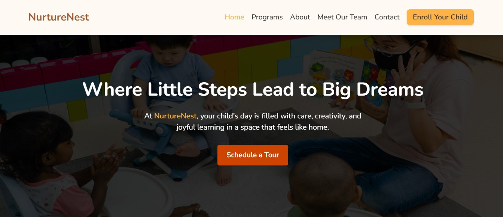
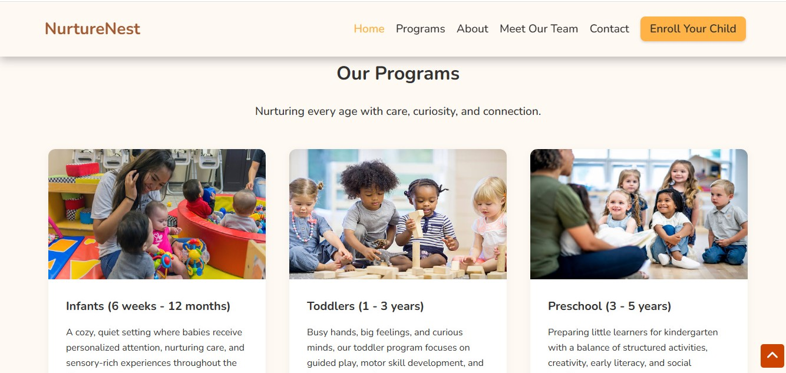

# NurtureNest - Childcare Website

**NurtureNest** is a concept website for a childcare center that helps parents to explore programs, meet caregivers, and book visits confidently. Built with HTML, CSS, and JavaScript, the site focuses on trust, clarity, and accessibility, offering a calm, welcoming experience that reflects the care and reliability families expect.

## 🌐 Live Demo:

[View the live site](https://nurturenestcare.vercel.app/)

## 📸 Screenshots:

### NurtureNest website Hero section

### NurtureNest website Programs section

## ✅ Features:

- **Programs section** - Interactive cards with modals detailing each program 
- **Meet the Team** - Showcasing staff to build trust and connection
- **Daily Moments gallery** - Responsive photo grid of daily activities
- **Testimonials** - Parent quotes as social proof
- **Call-to-action banner** - Invite parents to book visits or enroll

## Technologies Used:

- **HTML5** - Structuring website content
- **CSS3** - Custom styling with Flexbox/Grid, animations, responsive design
- **JavaScript** - Interactivity: Modals, accordion, and dynamic content

## 👤 Author:

**Chijioke Nwabasili**
- Portfolio: [chijiokenwabasili.vercel.app](https://chijiokenwabasili.vercel.app)

